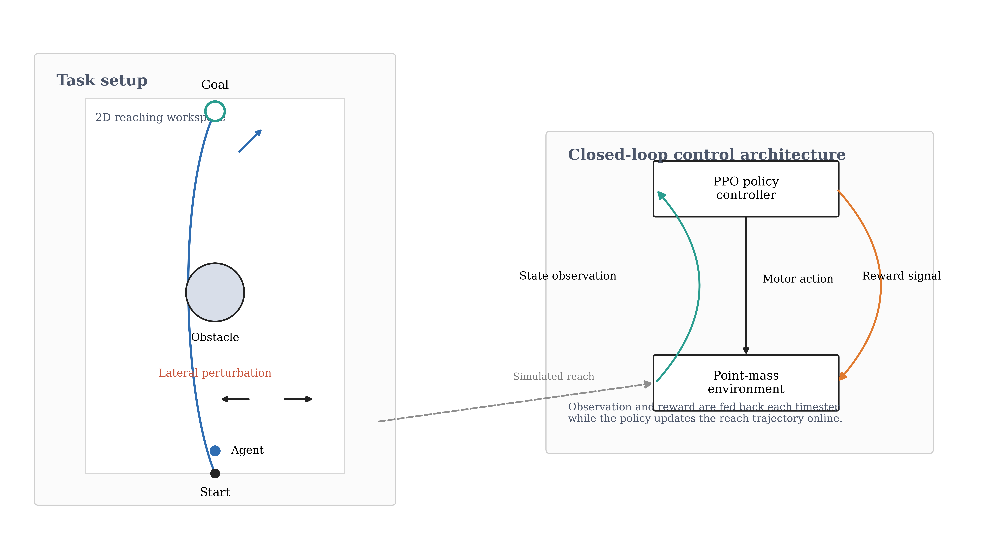
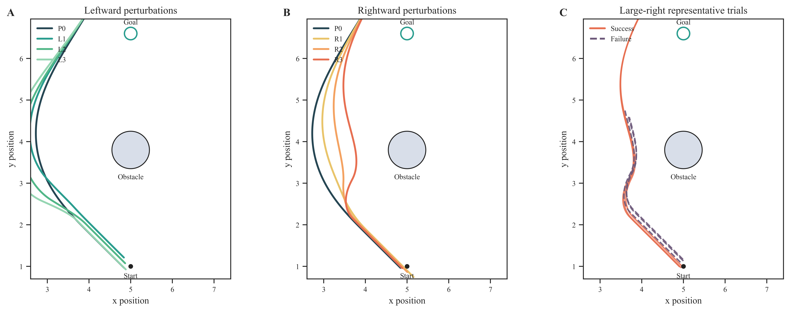
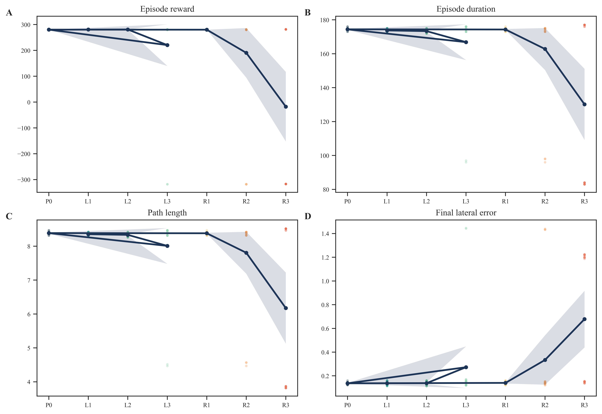
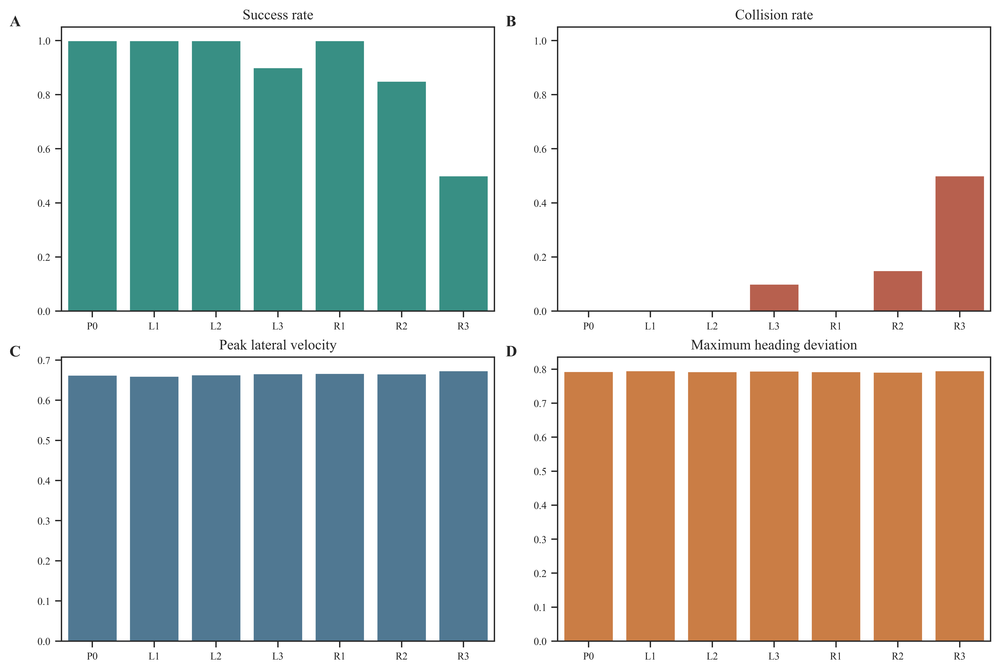

# NeuroRL-ObstacleAvoidance-v1.0

**Neural Population Dynamics Reveal Internal Representations Underlying Adaptive Obstacle Avoidance in Reinforcement Learning**

*Peter Ohue, Emily Oby, Gunnar Blohm — Centre for Neuroscience Studies, Queen's University*

A computational neuroscience framework that trains a reinforcement learning controller on a reaching-inspired obstacle-avoidance task, probes it with graded lateral force perturbations, and analyses the hidden-layer activity as a neural population signal using the same dimensionality reduction, trajectory analysis, and linear decoding tools applied to biological motor cortex recordings.

---

## Download

| Asset | Link |
|-------|------|
| **Manuscript PDF** | [`paper/manuscript_revised.pdf`](paper/manuscript_revised.pdf) |
| Fig 1 — Task schematic | [`paper/figures/fig1_schematic.svg`](paper/figures/fig1_schematic.svg) |
| Fig 2 — Trajectory overlay | [`paper/figures/fig2_trajectories.svg`](paper/figures/fig2_trajectories.svg) |
| Fig 3 — Velocity profiles | [`paper/figures/fig3_velocity.svg`](paper/figures/fig3_velocity.svg) |
| Fig 4 — PCA manifold & clustering | [`paper/figures/fig4_pca.svg`](paper/figures/fig4_pca.svg) |
| Fig 5 — Decoder confusion matrix | [`paper/figures/fig5_decoding.svg`](paper/figures/fig5_decoding.svg) |
| Fig 6 — Learning stability | [`paper/figures/fig6_learning.svg`](paper/figures/fig6_learning.svg) |

---

## Key findings

- A PPO controller trained purely for task reward spontaneously develops **compact low-dimensional hidden-layer representations** (\~75 % of variance in 2 principal components), consistent with neural manifold structure in motor cortex.
- Adaptation to lateral perturbations is expressed through **path-level corrections that preserve movement speed**, mirroring the kinematic signature of online feedback corrections in human reaching.
- A **direction-dependent asymmetry** in robustness emerges from the geometry of the learned trajectory: rightward disturbances are more disruptive than leftward ones of equal magnitude.
- **Extreme perturbation conditions produce linearly separable latent states**; mild conditions remain geometrically indistinct — a pattern mirroring difficulty-dependent decodability in biological motor cortex.

---

## Quick links

- Reproducibility guide: `docs/reproducibility_guide.md`
- Fork and contribute: `docs/fork_guide.md`
- Citation: `docs/citation_guide.md`
- Zenodo checklist: `docs/zenodo_release_checklist.md`

## Why this repository exists

This project bridges computational motor neuroscience and reinforcement learning interpretability.
We ask: does reward-driven optimisation produce internal representations with the same organisational features observed in biological motor populations?
The repository contains the full code, analysis pipeline, manuscript source, and publication figures needed to reproduce and extend these results.

## What is included

- PPO training and evaluation pipeline (Stable-Baselines3, Gymnasium).
- Behavioural analysis: trajectory geometry, kinematic metrics, perturbation statistics.
- Neural population analysis: PCA, tuning, linear decoding of hidden-layer activity.
- Six publication-quality SVG figures (Inkscape-ready, editable text).
- Complete LaTeX manuscript source with bibliography.
- Compiled PDF ready for submission.

## Repository structure

- `src/`: environment, training, evaluation, perturbation, and analysis utilities.
- `scripts/`: entry points for training, evaluation, and figure generation.
- `configs/`: environment, training, evaluation, and perturbation configurations.
- `experiments/`: outputs, checkpoints, logs, and derived analysis files.
- `paper/`: manuscript (`.tex`, `.pdf`), figures (SVG + PNG), and bibliography.
- `docs/`: project and reproducibility documentation.
- `tests/`: automated tests for core components.

## Quick start

### 1. Fork the repository

1. Open the GitHub repository page.
2. Click Fork.
3. Create the fork under your account or organization.
4. Clone the fork:

```bash
git clone https://github.com/<your-user>/NeuroRL-ObstacleAvoidance-v1.0.git
cd NeuroRL-ObstacleAvoidance-v1.0
```

5. Add upstream (recommended):

```bash
git remote add upstream https://github.com/OhuePeter/NeuroRL-ObstacleAvoidance-v1.0.git
git fetch upstream
```

Detailed fork workflow is in `docs/fork_guide.md`.

### 2. Create environment

Target reproducible environment: Python 3.11.

Conda option:

```bash
conda env create -f environment.yml
conda activate neurorl
```

Pip option (inside a Python 3.11 virtual environment):

```bash
pip install -r requirements.txt
pip install -e .
```

### 3. Run tests

```bash
pytest -q
```

### 4. One-click pipeline

After installation, run the reproducibility pipeline with a single command:

```bash
neurorl-run
```

Useful options:

```bash
neurorl-run --dry-run
neurorl-run --full
neurorl-run --no-tests
```

## Reproduce results and regenerate figures

Run all commands from repository root.

If you prefer the one-click workflow, `neurorl-run` executes the full post-training pipeline by default.
Use `neurorl-run --full` to include training.

### Step A. Train controller

```bash
python scripts/train.py
```

### Step B. Run Experiment 2 evaluation

```bash
python -m scripts.evaluate_experiment2
```

### Step C. Compute behavioural statistics

```bash
python scripts/analysis/statistical_analysis.py
python -m scripts.analysis.manuscript_statistical_tables
```

### Step D. Run neural analysis

```bash
python -m scripts.analysis.neural_analysis
```

### Step E. Generate manuscript figures

```bash
python scripts/plot_reaching_schematic.py
python -m scripts.analysis.manuscript_behavioral_figures
python -m scripts.analysis.manuscript_neural_figures
```

Expected key outputs:

- `paper/figures/figure1_schematic.pdf`
- `paper/figures/figure2_behavioural_trajectories.pdf`
- `paper/figures/figure3_behavioural_performance.pdf`
- `paper/figures/figure4_behavioural_adaptation.pdf`
- `experiments/version_2_0/results/neural_analysis/manuscript/figure1_neural_summary.pdf`
- `experiments/version_2_0/results/neural_analysis/manuscript/figure2_neural_pca_3d.pdf`
- `experiments/version_2_0/results/neural_analysis/manuscript/figure3_neural_trajectories.pdf`
- `experiments/version_2_0/results/neural_analysis/manuscript/figure4_success_failure.pdf`

Main-text figure policy: 8 figures total, with Figure 1 reserved for the task schematic.

## Documentation index

- `docs/project_overview.md`
- `docs/methodology.md`
- `docs/experiment_protocol.md`
- `docs/figures.md`
- `docs/figure_catalog.md`
- `docs/statistics.md`
- `docs/reproducibility_guide.md`
- `docs/fork_guide.md`
- `docs/fork_and_reproduce.md`
- `docs/citation_guide.md`
- `docs/paper_extract_and_notes.md`

## Figure gallery

### Figure 1: Adaptive reaching schematic



- Defines task context, geometry, and control framing.

### Figure 2: Behavioural trajectories



- Shows perturbation-dependent trajectory deformation.

### Figure 3: Behavioural performance



- Summarizes reward and kinematic performance distributions.

### Figure 4: Behavioural adaptation



- Reports robustness and compensation metrics.

Full figure descriptions for Figures 1-8 are available in `docs/figure_catalog.md`.

## Citation

Citation metadata is provided in `CITATION.cff`.

You can use the generated BibTeX in `docs/citation_guide.md`.

## License

This repository is licensed under the MIT License. See `LICENSE`.

## Funding and affiliation

This work was undertaken in part with support from the Connected Minds Program, Canada First Research Excellence Fund (CFREF), Grant CFREF-2022-00010.

Centre for Neuroscience Studies, Queen's University, Kingston, Ontario, Canada.