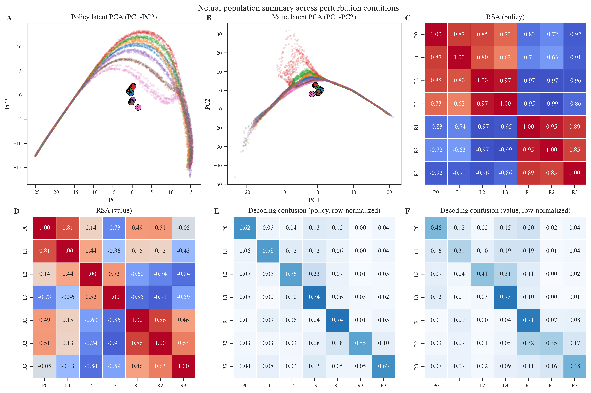
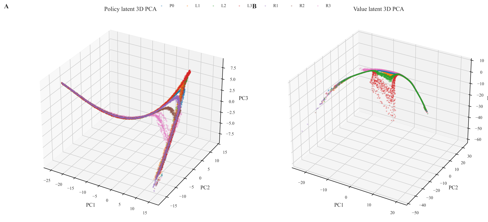
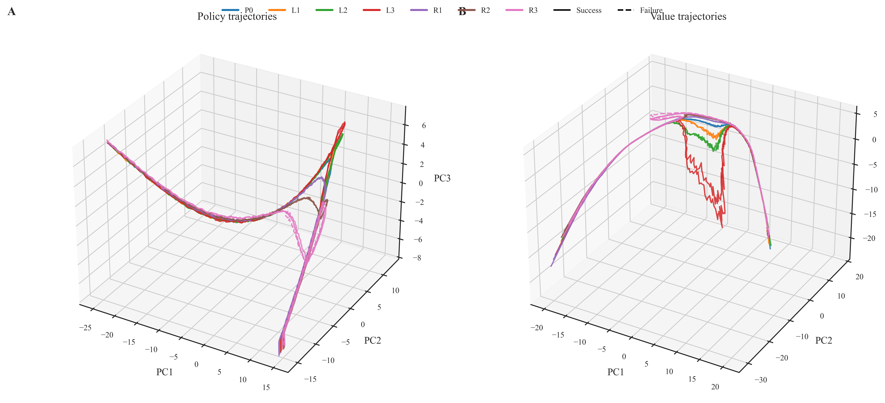
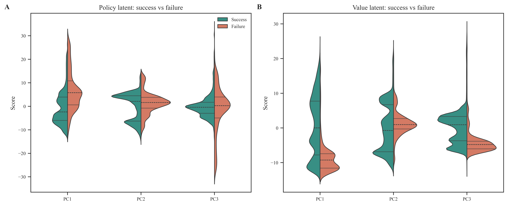

# Figure Catalog and Explanations

This catalog gives a publication-facing overview of current main figures with concise interpretation bullets.

## Figure 1: Task schematic

- Shows start position, goal, obstacle geometry, and control loop context.
- Defines the perturbation-focused adaptive reaching paradigm.
- Provides conceptual orientation for all downstream behavioural and neural analyses.

## Figure 2: Behavioural trajectories

- Compares trajectory deformation across control, leftward, and rightward perturbations.
- Visualizes how stronger perturbations reshape path geometry.
- Highlights success and failure patterns under challenging conditions.

## Figure 3: Behavioural performance

- Summarizes reward, duration, path length, and final lateral error distributions.
- Quantifies behavioural cost as perturbation magnitude increases.
- Supports inferential statistics reported in manuscript tables.

## Figure 4: Behavioural adaptation metrics

- Reports robustness indicators such as success and collision rates.
- Includes compensation-relevant kinematic indicators.
- Shows breakdown boundaries under large perturbations.

## Figure 5: Neural summary

- Aggregates latent PCA structure, representational similarity, and decoding outcomes.
- Demonstrates condition-level separability and overlap in internal representations.
- Serves as the top-level neural population evidence panel.

## Figure 6: Neural 3D PCA

- Displays low-dimensional manifold geometry for policy and value representations.
- Reveals condition-dependent neural occupancy in latent space.
- Supports interpretation of representational reorganization under perturbation.

## Figure 7: Neural trajectories

- Tracks temporal latent-state evolution at the episode level.
- Contrasts successful and failed dynamical routes.
- Highlights pathway-level adaptation signatures.

## Figure 8: Success versus failure neural states

- Compares latent neural state distributions by behavioural outcome.
- Identifies dimensions associated with robust versus failed control.
- Provides actionable hypotheses for mechanistic follow-up analyses.
