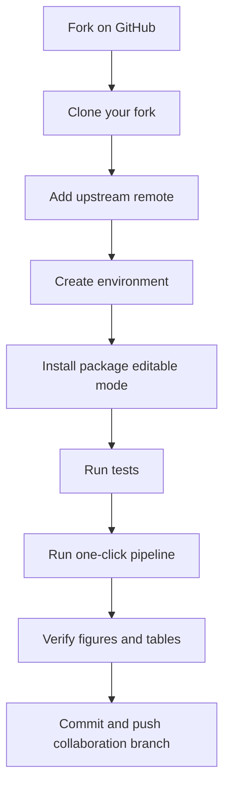

# Fork and Reproduce (Professional Workflow)

This guide is designed for collaborators, reviewers, and future project reuse.

## Scope

- Fork the repository cleanly.
- Keep your fork synchronized with upstream.
- Reproduce core outputs and manuscript figures.
- Use one-click execution for fast onboarding.

## Workflow overview



## 1. Fork on GitHub

1. Open the upstream repository page.
2. Click Fork.
3. Create your fork under your account or organization.

## 2. Clone your fork

```bash
git clone https://github.com/<your-user>/NeuroRL-ObstacleAvoidance-v1.0.git
cd NeuroRL-ObstacleAvoidance-v1.0
```

## 3. Add upstream remote

```bash
git remote add upstream https://github.com/OhuePeter/NeuroRL-ObstacleAvoidance-v1.0.git
git fetch upstream
git remote -v
```

## 4. Sync your fork regularly

Merge-based sync:

```bash
git checkout main
git fetch upstream
git merge upstream/main
git push origin main
```

Rebase-based sync (optional):

```bash
git checkout main
git fetch upstream
git rebase upstream/main
git push --force-with-lease origin main
```

## 5. Create reproducible environment

Conda path:

```bash
conda env create -f environment.yml
conda activate neurorl
pip install -e .
```

Virtualenv and pip path:

```bash
python -m venv .venv
# Windows
.venv\Scripts\activate
# Linux/Mac
# source .venv/bin/activate
pip install -r requirements.txt
pip install -e .
```

## 6. Validate installation

```bash
pytest -q
```

## 7. One-click reproduction

Default one-click pipeline:

```bash
neurorl-run
```

Common variants:

```bash
neurorl-run --dry-run
neurorl-run --full
neurorl-run --no-tests
```

## 8. Core outputs to verify

- `paper/figures/figure1_schematic.png`
- `paper/figures/figure2_behavioural_trajectories.png`
- `paper/figures/figure3_behavioural_performance.png`
- `paper/figures/figure4_behavioural_adaptation.png`
- `experiments/version_2_0/results/neural_analysis/manuscript/figure1_neural_summary.png`
- `experiments/version_2_0/results/neural_analysis/manuscript/figure2_neural_pca_3d.png`
- `experiments/version_2_0/results/neural_analysis/manuscript/figure3_neural_trajectories.png`
- `experiments/version_2_0/results/neural_analysis/manuscript/figure4_success_failure.png`
- `paper/tables/table1_descriptive_statistics.tex`
- `paper/tables/table2_assumption_tests.tex`
- `paper/tables/table3_omnibus_tests.tex`
- `paper/tables/table4_pairwise_posthoc.tex`

## 9. Collaboration branch workflow

```bash
git checkout -b feature/<short-description>
git add .
git commit -m "Add <scope>: <short-description>"
git push -u origin feature/<short-description>
```

Open a pull request with:

- Motivation and scientific rationale.
- Reproduction commands used.
- Output paths generated.
- Any limitations or caveats.
